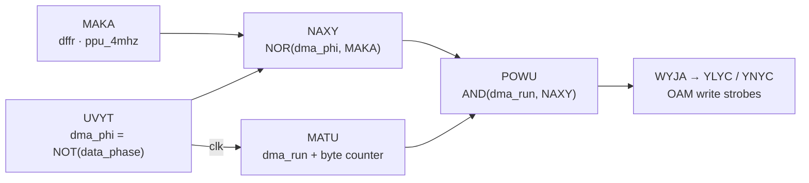

# The OAM Bus

Four sources can drive the OAM address bus; DMA preempts the other three
without ever contending the bus. Meanwhile the PPU's scan machinery keeps
running blind — and what it holds (not captures) during the overlap
is the mechanism behind the strikethrough and phantom-sprite artefacts.

```admonish abstract "At a glance"
- Arbitration is symmetric and clean: across every PPU-mode × `dma_run`
  combination, **exactly one** of the four drive-enables is asserted.
- Both PPU-side drivers tri-state via the same upstream gate
  (BOGE = NOT(`dma_run`)); the CPU path is gated in ASAM's OR3.
- OAM is a **two-bank SRAM**: every read presents an aligned (even, odd)
  byte-pair; a0 matters only for writes.
- **While DMA holds the bus, no capture path can fire** — the Stage-1
  latches hold the pre-DMA byte-pair while the scan counter runs, filling
  the sprite store with phantom copies if the held Y matches. A DMA that
  ends mid-scan lets the entries scanned afterward capture fresh OAM.
```

## OAM address-bus arbitration

Four sources drive the bus through active-low tri-state enables; at any
instant exactly one is asserted.

| Source | Drive-enable signal | Driver gate | Asserted when |
|--------|---------------------|-------------|---------------|
| CPU port | `oam_addr_cpu_n` | ASAM (or3) | OR3(mode2, mode3, `dma_run`) = 0 (= AJUJ = 1, lock open) |
| DMA | `oam_addr_dma_n` | DUGA (not_x2) | `dma_run` = 1 |
| OAM scan (Mode 2) | `oam_addr_parse_n` | APAR (not_x2) | mode2 = 1 |
| Sprite fetch (Mode 3) | `oam_addr_render_n` | BETE (not_x1) | AJON = 1 |

The CPU enable carries all three PPU-state conditions in ASAM's OR3; the
parse and render enables terminate in their mode-nets, themselves gated
through BOGE = NOT(`dma_run`) upstream:

- **Parse**: mode2 = AND2(BOGE, `oam_parsing`) (ACYL) — DMA forces
  mode2 = 0 regardless of BESU; APAR tri-states the parse driver.
- **Render**: AJON = AND2(mode3, BOGE) — DMA forces AJON = 0 regardless of
  XYMU; BETE tri-states the render driver.

| PPU mode | `dma_run` | CPU | DMA | Parse | Render | Bus owner |
|----------|:---------:|:---:|:---:|:-----:|:------:|-----------|
| Mode 0 / VBlank | 0 | drive | — | — | — | CPU |
| Mode 0 / VBlank | 1 | — | drive | — | — | DMA |
| Mode 2 | 0 | — | — | drive | — | Parse |
| Mode 2 | 1 | — | drive | — | — | DMA |
| Mode 3 | 0 | — | — | — | drive | Render |
| Mode 3 | 1 | — | drive | — | — | DMA |

Every cell has exactly one driver — the bus is never contended (dmg-sim
measurement, Hacktix `strikethrough` ROM: with `dma_run`=1 and BESU.q=1
mid-scan, mode2 = 0, only the DMA driver active).

## Per-T-cycle structure of the byte transfer



`dma_run` (the M-cycle-stable active flag) is the Q of the MATU DFF, clocked
by `dma_phi`. Within each 4-T-cycle byte transfer:

- `dma_phi` = NOT(`data_phase`) (gate UVYT) — high during the address-phase
  half (T1–T2) and low during the data-phase half (T3–T4) of each M-cycle.
- MAKA (DFF, `ppu_4mhz`) carries the byte-transfer state; with `dma_phi`
  it gates the read-then-write structure.
- NAXY = NOR2(`dma_phi`, MAKA) rises only when both are 0, identifying the
  sub-window within each byte where the write strobe fires.
- POWU = AND2(`dma_run`, NAXY) asserts the OAM write arm during that
  sub-window; the resulting WYJA → YLYC/YNYC strobe chain
  ([OAM writes](../oam-vram-access/oam-writes.md)) commits the byte.

Each byte transfer therefore has two sub-phases with the same address-bus
owner (DMA) but different OAM-bus activity:

1. **Read-phase sub-window** — DMA address asserted, no write strobe; the
   SRAM presents the *prior* contents of DMA's destination cell.
2. **Write-phase sub-window** — POWU arms WYJA, the strobe fires, and the
   SRAM commits DMA's source byte into the destination cell.

## The strikethrough effect: the PPU keeps running

DMA gating tri-states the PPU-side **bus drivers** only — the scan and
fetch machinery keeps running: BESU still sets on Mode-2 entry
(CATU.q), the scan counter clocks, and the Y comparator, sprite store,
and fetch state machine all keep operating. They just sample the OAM data
bus while the SRAM is decoding **DMA's destination address**.

This is the mechanism behind the Hacktix `strikethrough.gb` "+" overlay:
the sprite store on affected scanlines fills with the Y/X byte-pair the
Stage-1 latches held when DMA began — captures are gated off for the whole
overlap, so no freshly-written OAM byte reaches the store.

## The two-bank SRAM

OAM is two parallel 80-byte banks:

| Bank | Stores | Write strobe |
|------|--------|--------------|
| A | odd addresses (X position, attribute) | `oam_a_wr2`, selected when a0=1 |
| B | even addresses (Y position, tile index) | `oam_b_wr2`, selected when a0=0 |

Both banks share the address inputs (row decode from a3..a7 — the wordline
row, an 8-byte sprite pair; column mux from a1..a2 — the column within the
row) and the output enable. (Logically that same address is sprite index
`a2..a7`, byte-within-sprite `a0:a1`.) **Reads ignore a0**: on every read, bank B presents `OAM[addr & ~1]`
and bank A presents `OAM[addr | 1]` — the bus is effectively 16 bits wide,
always carrying an aligned (even, odd) byte-pair. a0 matters only for writes.

## The scan-chain capture hold

**Stage-1 capture: one shared enable for 16 dlatches.** Each output-bus
bit is captured by a single dlatch clocked by `oam_data_latch` (ODL):

- **X side (bank A)** — XYKY, YRUM, YSEX, YVEL, WYNO, CYRA, ZUVE, ECED;
- **Y side (bank B)** — YDYV, YCEB, ZUCA, WONE, ZAXE, XAFU, YSES, ZECA.

All 16 share the same enable — the Y and X operands always update together
as a byte-pair.

**The ODL source.** `oam_data_latch` = NOT(AND3(AJEP, XUJA, `cpu_oam_rd_n`))
(gate BODE). Three contributing paths:

1. **Mode-2 scan tick** — AJEP = NAND2(mode2, XOCE) falls once per
   2-dot scan step while mode2=1 (XOCE toggles at the scan cadence —
   [OAM scan](../oam-scan.md)). One byte-pair per sprite entry.
2. **Mode-3 sprite-fetch capture** — XUJA = 0 requires mode3=1 plus
   sprite-fetch counter state (TUVO decode); one pulse per sprite fetch.
3. **CPU OAM read** — `cpu_oam_rd_n` = 0 during a CPU OAM read.

**During DMA + Mode 2 overlap, no path can fire.** DMA forces mode2 = 0
(path 1), mode3 = 0 in Mode 2 kills the TUVO decode (path 2), and CPU OAM
reads are blocked (path 3). Measured across an overlapped Mode 2's 80
dots: zero ODL pulses (dmg-sim measurement, Hacktix `strikethrough` ROM).
The Stage-1 latches hold whatever byte-pair they captured **before DMA
started**, for the whole overlap:

- the last Mode-2 scan tick of the prior line holds (sprite 39 Y, sprite 39 X);
- a Mode-3 sprite fetch after that holds the last fetched sprite's
  (tile index, attribute);
- a CPU OAM read during H-Blank holds whatever pair the CPU read.

Whichever fired most recently before `dma_run`↑ pins the held pair.

Meanwhile the scan counter advances through all 40 entries (its clock is
not DMA-gated, only its bus driver), the Y comparator evaluates the *held*
Y against LY every step, and — on a match — the store fills successive
slots with the same held X byte: phantom sprites.

A long DMA window confirms the hold directly: across one full DMA the 16
Stage-1 dlatches show zero transitions, a Mode-2 entry lands inside the hold
span without effect, and the first post-DMA scan tick reflects the
freshly-written OAM (dmg-sim measurement, gambatte `late_sp00x_2`
re-trigger stream).

**Stage-2 latches.** Between Stage 1 and the comparator/X-storage chain sits
a second dlatch_ee rank (Y side: XUSO and siblings; X side: YLOR and
siblings), enabled by COTA = NOT(BYCU), BYCU = NAND3(CUFE, XUJY, AVER) — a
net AND3. During DMA with the CPU off $FExx, CUFE reduces to `dma_phi`, so
Stage 2 is transparent during T1–T2 and holds during T3–T4 of each DMA
M-cycle. Since Stage 1 holds throughout the overlap, Stage 2's windows
merely re-affirm the held value.

**The SRAM forces the aligned-pair capture model** — two plausible
alternatives do not hold:

| Model | Verdict |
|-------|---------|
| (i) Aligned-pair: latch (OAM[addr & ~1], OAM[addr \| 1]) regardless of a0 | **Structurally correct** — the two-bank SRAM forces this on every read |
| (ii) Bus-following per-dot: each latch samples whatever single byte `dma_a` addresses | Incorrect — the 16 dlatches share one enable; they never alternate per dot |
| (iii) Same-byte-twice on both operands | Incorrect — the banks store different physical bytes |

```admonish warning "Pitfall: the aligned-pair model is not exercised during the overlap"
Model (i) is correct at the SRAM level, but the scan chain does not exercise
it during a DMA + Mode-2 overlap because ODL is gated off — a per-dot
aligned-pair model over-counts the captures by ~40× versus hardware's zero.
```

**The DMA-end escape.** The held-byte gating lasts only as long as the DMA
holds the bus. A DMA that *ends part-way through Mode 2* releases the OAM bus
mid-scan, and every entry the counter has not yet visited is then read from
the freshly-written OAM — so a sprite DMA'd into a not-yet-scanned slot is
captured normally. This is the mechanism behind the diverging
`oamdma_late_sp*` outcomes: not a path outside the held-pair rule, but its
boundary — captures resume the instant DMA releases the bus.

```admonish info "Measured: capture resumes at the DMA-end, mid-scan"
A purpose-built ROM (carttype-0x00 DMG; OAM pre-filled uniform $A0 with one
real sprite DMA'd into slot 20 — scanned at dot 40 of Mode 2 — and the
DMA-end swept across that read) pins it: the sprite is captured in exactly
the frames whose DMA ends **before** dot 40 (`save_sprite_num0` fires; Mode 3
lengthens from the 173.481 baseline to 184.5 dots, the +11-dot single-sprite
penalty), and never in the frames whose DMA is still running when slot 20 is
read. The capture/no-capture boundary sits exactly at the slot's scan-read
(dmg-sim measurement).
```
