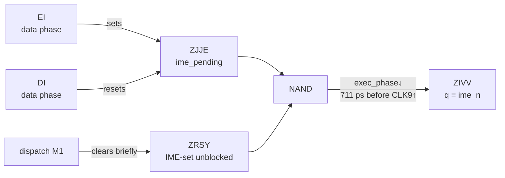

# HALT and EI

HALT and EI both look like one-line behavioural rules ("HALT waits for an
interrupt"; "EI takes effect one instruction late") and both decompose into
small gate clusters with measurable consequences — per-source wake
latencies, the HALT bug, and the exact PC arithmetic of interrupted HALTs.

```admonish abstract "At a glance"
- `data_phase` is held LOW throughout HALT: the IF latches go
  **transparent** and OAM DMA **pauses**.
- Wake latency splits by source phase at YOII's setup window: timer wakes
  cost **6 M-cycles**, every other source 5 — one missed DFF setup, no
  "wakeup NOP".
- **IME enables mid-EI's own M-cycle**; the one-instruction delay lives in
  the *dispatch* set gate, not the IME path.
- The HALT bug is **IDU-suppression ± dispatch-compensation** — there is
  no separately-gated bug path.
- Whether the halt latch sets is decided at **one CLK9 edge**, bounded by
  the IF-latch window at +1.978 dots into the body M-cycle.
```

## HALT: the state and the wake

Three cells carry HALT:

- **YOII** (`irq_latched`) — the same CLK9 capture the dispatch chain uses;
- **YKUA** — an OAI21 whose output is the halt latch's active-low reset;
- **YNKW** — the halt RS latch; q = `halt`, chip-level clock enable = NOT(halt).

When `irq_latched` captures a pending interrupt, YKUA pulls low
combinationally and the halt latch resets — no M-cycle-aligned gating
anywhere in the release.

**`data_phase` is held LOW throughout HALT.** Two big consequences:

1. Every per-bit IF latch is *transparent* for the whole HALT (the enable
   is `data_phase_n`) — a source rise propagates combinationally to
   `irq_pending` regardless of its dot phase.
2. `dma_phi` = NOT(`data_phase`) is held HIGH — any in-flight OAM DMA
   pauses for the duration ([DMA](dma/boundaries.md)).

### Per-source wake latency

The wake latency splits by *source phase relative to CLK9*, at YOII's
setup window (dmg-sim measurements):

| Source | `irq_pending`↑ phase in M-cycle | Setup at next CLK9↑ | Handler entry from `irq_pending`↑ |
|--------|---------------------------------|---------------------|------------------------------------|
| Timer | ~3.6 ns after the boundary (boundary-aligned by construction — MOBA is a CLK9 DFF) | **misses** — waits a full M-cycle | 5,854,711 ps ≈ **6 M-cycles** |
| VBlank / LYC | ~88% into the M-cycle | meets (~117 ns margin) | ≈ **5 M-cycles** |
| HBlank STAT | WODU is ALET↓-aligned; ≥122 ns from any CLK9↑ at every SCX | meets | ≈ **5 M-cycles** |
| OAM STAT | RUTU at +1.5 dots; chain 4,847 ps | meets (~606 ns margin) | ≈ **5 M-cycles** |

The timer's extra M-cycle is one missed DFF setup window — there is no
"wakeup NOP" in the sequencer. Everything downstream of YOII is uniform
across sources to within ~0.1 ns.

### IME=0 wake: one M-cycle faster

With IME=0 and IE & IF ≠ 0, the same release chain runs but no dispatch
fires (the set gate ZAIJ is held low by `ime_n`). The M-cycle counter was
parked at m7 throughout HALT — and m7 *is* a fetch state — so **the wake
M-cycle is itself the post-HALT opcode fetch**: the phase ring restarts,
`data_phase` rises at +1.999 dots, the bus reads PC mid-data-phase, and the
next instruction's body begins at the following boundary. Measured edge by
edge: halt↓ at +4,226 ps after the wake CLK9↑, fetch read at +2.0 dots, PC
advance at +4.01 dots (dmg-sim measurement, mooneye
`halt_ime0_nointr_timing`). The IME=1 path spends this M-cycle capturing
`dispatch_active` instead and discards the wake fetch.

### The HALT-wake boundary cases

Two LYC-source anchors pin the subtler structure (dmg-sim measurements,
paired HALT and running-CPU ROMs):

- **On the LY 153→0 wrap**, the IF-driving edge is ROPO's capture one TALU
  period after MYTA; HALT's transparent IF latch fires `irq_pending` ~113 ns
  earlier than the running CPU's gated latch — and that head start is
  *exactly absorbed* by the halt-release chain's extra capture M-cycle.
  **Both paths commit `dispatch_active` on the identical wall-clock edge.**
- **On ordinary increments (LY=N→N+1)**, the pre-capture cascade differs
  (PALY rises ~2 dots before ROPO's edge instead of ~4 ns after MYTA) but
  every ROPO-relative anchor is picosecond-identical across iterations —
  the post-HALT phase-ring shift (~1 ns) settles by the first iteration
  and never accumulates.

One structural surprise survives into handler code: the first handler
instruction with a memory write runs **M1→M2→m7** after a HALT wake but
**M1→m7→M2** after a running-CPU dispatch — a one-M-cycle wall-clock shift
in the write's position, uniform across iterations (measured on 8 write
pairs). For LCD-column-sensitive handlers (mid-Mode-3 palette writes),
HALT-entered handlers land their writes 4 dots earlier than
running-CPU-entered ones.

```admonish question "Open question: the M2/m7 ordering"
A gate-level decomposition of the ordering difference — and the
reconciliation of one reference image whose column shift runs the *other*
way — remains open. See [Appendix C](open-questions.md).
```

## The EI pipeline



The IME path is one DFF (ZIVV, q = `ime_n`, clocked once per M-cycle on
`exec_phase` falling — 711 ps before CLK9↑) fed by a NAND of two SR
latches: ZJJE (`ime_pending` — "EI seen, not yet cancelled") and ZRSY
("IME-set unblocked" — cleared briefly during dispatch so dispatch can
force IME off). There is **no DFF chain**, and the one-instruction delay is
*not* in this path:

- **IME enables mid-EI's own M-cycle** — at ZIVV's capture on that
  M-cycle's closing `exec_phase`↓ (dmg-sim measurement).
- The delay lives in the *dispatch* set gate: ZAIJ is blocked during
  EI/DI's data phase, so `dispatch_active` cannot capture until the
  *next* instruction's M-cycle. Total EI → handler entry: exactly
  6 M-cycles (EI + one successor instruction + dispatch M1–M4), with the
  successor's boundary — not its opcode — controlling the capture.

**DI cancels combinationally.** DI's data phase resets `ime_pending`
through the same gate dispatch uses; IME disables at DI's own capture
edge. `EI; DI` yields ~1 M-cycle of IME with no dispatch possible in it;
`EI; NOP; DI` dispatches during the NOP and the DI never executes until
the handler returns to it.

## EI; HALT and the HALT bug — one mechanism

HALT's body M-cycle suppresses the normal IDU+1 (the PC-advance gate is
masked while the HALT decode flag is set), so PC holds HALT+1 across the
boundary. Everything observable follows from composing that suppression
with the dispatch sequence's universal −1:

| IME | IF & IE at HALT decode | What happens |
|-----|------------------------|--------------|
| 1 | ≠ 0 | Dispatch fires via the *running-CPU* path mid-HALT-M-cycle (the halt latch never sets — `irq_latched` already holds its reset low). PC: HALT+1 − 1 = **HALT** is pushed; RETI re-enters HALT. Measured end to end on the hardware-verified AGE `ei-halt` ROM: both anchors push exactly the HALT address |
| 0 | ≠ 0 | No dispatch, no −1, halt latch never sets: the post-HALT M-cycle re-reads PC = HALT+1 — **the byte after HALT executes twice** (the Pan Docs HALT bug) |
| 0 | = 0 | Halt latch sets; the CPU idles; the wake path above applies |

There is no separately-gated "bug path": the folk model of one is wrong —
the behaviour is IDU-suppression ± dispatch-compensation.

### The halt-bug detection edge

Whether the halt latch sets at all is decided at **one CLK9 edge** — the
one opening the M-cycle after HALT's body, which captures both the
HALT-delayed flag and `irq_pending` (into YOII). The reset-dominates-set
latch then resolves: YOII captured 1 → latch stays unset (halt-bug /
dispatch regime); YOII captured 0 → latch sets (halt-wait regime).

Because the IF latch is data-phase-gated *during the body M-cycle*, the
boundary between regimes is the latch window: a source rising before dot
1.978 of the body M-cycle reaches YOII in time; one rising after is held
past the edge. Measured across an 8-iteration SCX sweep that walks a
STAT source across the body M-cycle dot by dot: iterations with the rise
at +0.5/+1.5 dots produce the halt-bug outcome, the rise at +2.5 onward
produces halt-wait — a 3-of-8 split exactly matching the
hardware-verified pass signature `02 02 02 01 01 01 01 01` (dmg-sim
measurement, AGE `halt-m0-interrupt`). No additional gates or
multi-edge windows are required.
