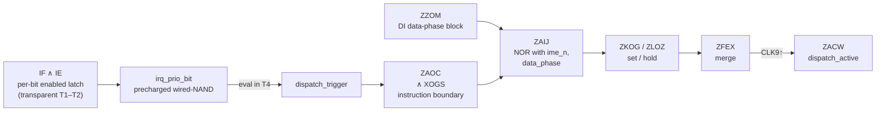

# Interrupt Dispatch

When an unmasked interrupt is latched into IF with IME=1, the CPU dispatches
to its handler through a fixed 5-M-cycle sequence. The behavioural shape —
five M-cycles, two pushes, the vector table — is standard reference material
([gb-ctr](https://gekkio.fi/files/gb-docs/gbctr.pdf)); this chapter documents
the machinery: the CLK9-cadence capture DFF, the precharged-evaluate priority
chain, the instruction-boundary gate, the per-edge write-back rule, and the
measured slip regimes.

```admonish abstract "At a glance"
- The IF & IE latch is **transparent through T1–T2 and opaque during the
  data phase** — that gating decides every slip regime.
- Dispatch latency = **(body M-cycles remaining) + (1 if no-overlap) + 4**;
  overlap-capable instructions dispatch at the body's closing CLK9↑.
- Write-back and dispatch capture **on the same CLK9 edge** — the
  in-flight instruction always retires.
- The dispatch sequence applies a **universal IDU −1** to PC — which is
  also why RETI re-enters HALT.
- The IE push bug's race window is **exactly M3's data phase**.
```

| Semantic name | Cell / wire | Role | Type | Notes |
|---|---|---|---|---|
| `irq_latched` | YOII (`g42`) | Pending-interrupt capture | DFF on CLK9 | Samples IF & IE once per M-cycle; forks into the running-CPU and halt-release chains |
| `irq_pending` | wire `int_pending` | Dispatch eligibility | combinational | Per-bit IF & IE through the priority chain |
| `dispatch_trigger` | wire `int_take` | Dispatch trigger | combinational | Pulses in the eval phase (T4) of fetch M-cycles |
| `dispatch_active` | ZACW, wire `int_entry` | Dispatch capture | DFF on CLK9 | Q↑ starts the 5-M-cycle sequence |
| CLK9 | — | CPU M-cycle clock | — | One rising edge per M-cycle = dot-0 ALET↑ + 2,983 ps; period 976,000 ps, zero jitter |

**CLK9, pinned.** CLK9↑ is physically the master-clock rising edge that opens
each M-cycle — the dot-0 ALET↑, reached through the CPU clock-tree buffers
2,983 ps later. Every "M-cycle boundary" in this part of the book is this
edge.

## The capture chain, cell by cell



From the per-bit IF latches to `dispatch_active`:

1. **Per-bit IF & IE latch** (`irq_latch<0..4>`) — an *enabled D-latch*, not
   a DFF: transparent while `data_phase_n`=1 (dots −0.022…1.978 of each
   M-cycle) and opaque during the data phase (+1.978…+3.978 dots). This gating is
   load-bearing for half the timing behaviour in this part.
2. **Priority chain** (`irq_prio_bit<0..4>`) — a precharged wired-NAND bus:
   precharged high through T1–T3, evaluated when `write_phase` rises in
   T4. The highest-priority pending bit wins.
3. **`dispatch_trigger`** = NOT of the bus — rises at the T4 eval phase,
   240,200 ps before the next CLK9↑. The FST-observed ~729 ns from a
   mid-M-cycle `irq_pending`↑ to `dispatch_trigger`↑ is the *wait for the
   eval phase*, not gate propagation.
4. **Boundary and blocking gates** — ZAOC combines the trigger with the
   instruction-boundary signal XOGS; ZZOM blocks during DI's data phase;
   ZAIJ = their NOR with `ime_n` and `data_phase` — the set condition.
5. **Set / hold SR latches** (ZKOG, ZLOZ) and the merge (ZFEX) feed
   **ZACW**, which captures on CLK9↑. ZKOG initiates; ZLOZ holds through
   dispatch M2–M5.

**The instruction-boundary signal XOGS** = (data_phase ∧ `ctl_fetch` ∧
¬CB-prefix) ∨ idle. `ctl_fetch` asserts during the data phase of whichever
M-cycle performs the next opcode fetch — and that is where instruction
classes split:

- **Overlap-capable instructions** (NOP, ALU r, INC r, JR, POP's last cycle,
  EI/DI, HALT, …— 21 sequencer states): the terminal body M-cycle has no bus
  traffic of its own and carries the next fetch. Dispatch can fire at the
  body's closing CLK9↑.
- **No-overlap instructions** (memory writes, indirect reads, pushes, and a
  few internal-arithmetic terminals): the bus is busy in the terminal body
  M-cycle, so the sequencer inserts a **dedicated post-body fetch M-cycle**,
  and dispatch fires one M-cycle later than the body. Two counter states
  carry it:
    - **m6** — the indirect-read-into-register subclass (six states,
      including the dispatch sequence's own vector fetch).
    - **m7** — the memory-write/push/internal subclass (twenty states);
      also the force-path parking state during HALT, reset, and
      condition-failed branches.

The latency formula: **(body M-cycles remaining) + (1 if no-overlap) + 4**.

## The dispatch sequence

| M-cycle | Bus | State change |
|---------|-----|--------------|
| 1 | internal | IME cleared; the IDU −1 step on PC (below) |
| 2 | internal | — |
| 3 | write PC-high to SP−1 | SP decremented |
| 4 | write PC-low to SP−2 | SP decremented; **vector resolved** |
| 5 | opcode fetch from vector | PC = $40/$48/$50/$58/$60 |

**The universal IDU −1.** Dispatch decrements PC once during its internal
cycles, on *every* dispatch path. For ordinary in-flight instructions, PC
holds addr+2 at the dispatching edge (fetch + overlap increment) and the −1
yields the correct return address addr+1. For HALT — whose own increment is
suppressed — the same −1 yields the HALT address itself, which is why RETI
re-enters HALT ([HALT and EI](halt-ei.md)).

### The IE push bug, gate by gate

When M3's push of PC-high lands on $FFFF, the write updates IE mid-dispatch:

1. M3 data phase: `reg_ie` captures the pushed byte; the per-bit NAND
   re-evaluates combinationally — but the IF&IE latch is *opaque* (data
   phase).
2. At the M3→M4 boundary, `data_phase_n`↑ — ALET-pinned, just before the
   next CLK9↑ (tail of T4; the precise offset is in
   [CPU-visible boundaries](cpu-visible-boundaries.md)) — re-opens the
   latch, which captures the post-write value.
3. M4's dot-3 eval re-runs the priority chain on the new state; M5's fetch
   address derives from it.

The race window is therefore **exactly M3's data phase**: an IE write there
wins; one in M4's data phase is too late. And if the write *clears* the
dispatching bit, the priority chain finds nothing — the vector drives
$0000, and the acknowledge (which requires the bit still pending) never
fires, leaving the IF bit set: the canonical mooneye `ie_push` observation.

## Write-back and dispatch share one edge

For an instruction retiring at the dispatching CLK9↑, the register-file
DFFs, the PC DFFs, and ZACW all capture **on the same edge** — register
write-back settles at +210–417 ps, `dispatch_active` at +983–1,190 ps.
There is no "dispatch pre-empts write-back" race, and the IF-coincident
M-cycle is *not* converted to a no-retire cycle.

Verified across four HBlank-STAT anchors at three different WODU dot
phases, and generalised across sources:

- **LYC** — source rise at +3.499 dots (T4) of the *prior* M-cycle;
- **Timer** — boundary-aligned at +0.000; the phase that costs a HALT wake
  an extra M-cycle costs running-CPU dispatch *nothing* (the trigger has
  ~972 ns of margin);
- **OAM STAT** — +1.502 dots (T2).

In every case the in-flight instruction commits its result and the
handler-entry register values match the hardware-verified ROM expectations
(dmg-sim measurements).

## Running-CPU edge timing and the slip regimes

For a mid-M-cycle `irq_pending`↑ during a one-M-cycle instruction:

| Event | Δ from `irq_pending`↑ |
|---|---:|
| `dispatch_trigger`↑ | +728,721 ps (the dot-3 eval) |
| `dispatch_active.q`↑ | +969,330 ps (the closing CLK9↑) |
| PC = vector | +4,878,688 ps ≈ **5.000 M-cycles** |

**Steady-state invariance.** In a steady scanline loop the WODU dot phase
repeats identically, so the ~732 ns spread across the four possible dot
phases produces **zero spread** in the dispatching edge.

**The first-WODU slip.** The first H-Blank after LCD-on lands at M-cycle
dot phase (1.556 + (SCX & 7)) mod 4, and here the IF-latch gating bites:
LALU.q rising *before* +1.978 dots propagates combinationally
(`irq_pending`↑ +12,333 ps — no slip); rising *after* +1.978 is held
by the opaque latch until it reopens at the next boundary (`irq_pending`↑
one M-cycle late — **dispatch slips +1 M-cycle**).

The LALU.q edge rises just after WODU↑, at phases 0.567/1.567/2.567/3.567.
Phases 0.567/1.567: no slip; 2.567/3.567: held +356,788/+112,788 ps, both
releasing at exactly boundary +0.029 dots (dmg-sim measurement, the SCX
sweep — each phase replicated across two SCX values plus the lcdon
family). The resulting per-SCX handler-entry values match the
hardware-verified ROM directives
([LCD-on → first WODU](scanline-frame-timing/lcd-on-to-wodu.md) carries
the combined table).

**Same numerical phase, no slip — the calibrated-loop escape.** Test
families that re-calibrate their NOP padding per SCX place WODU at
+2.556/+3.556 dots *of the M-cycle before* the fetch M-cycle: the held latch
re-opens at that boundary, leaving the full fetch M-cycle for the trigger
to settle — identical dispatching edge across all SCX (dmg-sim
measurements across the eight-ROM cluster, including an anchor where the
fetch M-cycle is an ordinary NOP body). The slip is a property of *where
the rise falls relative to the latch windows*, not of the numerical dot
phase.

```admonish note "For implementors"
The boundary values: the IF-latch is transparent in [−0.022, 1.978] dots
of each M-cycle and opaque in [1.978, 3.978] (the open edge measured from
the held-release convergence at boundary +0.029 minus the +12,333 ps
combinational leg); `data_phase_n`↑ at +965,635 ps; the measured
trigger-to-capturing-CLK9↑ setup in the steady case is 240,200 ps.
```

Finally, the sequencer state at a measured dispatching edge confirms the
gate story end to end: at WODU↑ the in-flight state reads the fetch
M-cycle (m6 of `ld a,(hl)` or a NOP body), `ime_n`=0, the DI-block gate
inactive — and a *trailing* DI (the next instruction, already fetched)
does not block dispatch, because ZZOM looks at the in-flight instruction
only (dmg-sim measurement).
