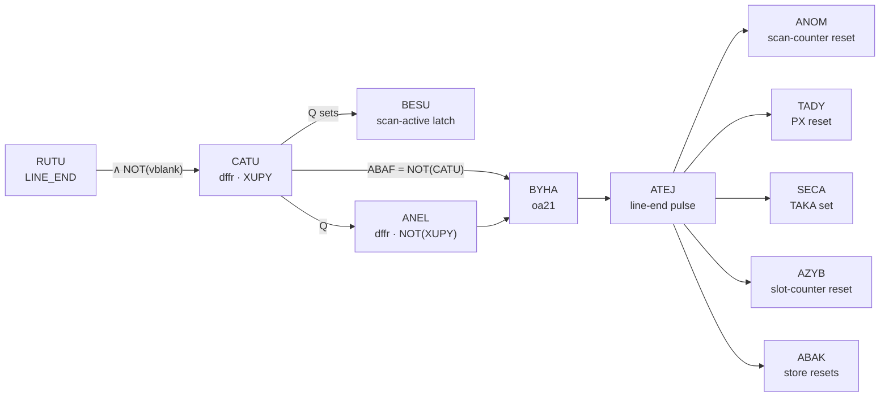

# Mode Transitions

Mode transitions are the state-machine edges between Modes 2, 3, 0, and 1.
Each is driven by a specific signal event: AVAP↑ starts Mode 3; the
WODU → VOGA → WEGO chain sets XYMU to end it; the RUTU → NYPE distribution
ends the scanline into Mode 2 or Mode 1; the CATU/ANEL chain re-initialises
the Mode 2 machinery at each boundary; MYTA fires at frame end. This chapter
walks each edge.

```admonish abstract "At a glance"
- Mode 2→3: AVAP↑ resets XYMU directly — a **0.483-dot pulse that is not
  ALET-rising-aligned** (it reacts to the falling edge).
- Mode 3→0: WODU → VOGA → WEGO → XYMU in **0.436 dots** — Mode 3 ends
  within the same dot WODU fires; baseline total 173.481 dots.
- Scanline end: RUTU → NYPE splits across **two TALU edges** — POPU
  (Mode 1) first, MYTA (FRAME_END) and MEDA one period later.
- The CATU/ANEL chain turns RUTU into the **ATEJ line-end pulse** feeding
  five subsystems — and the LCD-on path **bypasses it entirely**, which is
  why the first scanline has no Mode 2 STAT phase.
```

## Mode 2 → Mode 3

AVAP — the scan-complete pulse ([OAM scan](oam-scan.md)) — drives XYMU's
reset directly: AVAP↑ clears XYMU to Q=0 and Mode 3 begins. AVAP's four
netlist consumers:

| Cell | Type | Role |
|------|------|------|
| ASEN | or2 | OR2(ATAR, AVAP) — clears the scan-active latch BESU |
| NYXU | nor3 | NOR3(AVAP, MOSU, TEVO) — BG fetch counter reset ([BG pipeline](bg-pipeline/fetcher.md)) |
| POME | nor2 | NOR2(AVAP, POFY) — per-scanline synchroniser of the ST sync loop ([LCD output](lcd-output.md)) |
| XYMU | nor_latch | reset pin — Mode 3 starts |

```admonish warning "Pitfall: AVAP is not ALET-edge-aligned"
It rises ~0.018 dots after an ALET *falling* edge (BYBA's XUPY-clocked
capture) and falls ~0.483 dots later when DOBA captures on the subsequent
ALET *rising* edge — the 0.483-dot pulse straddles one ALET rising edge.
Snapping AVAP to the nearest ALET rising edge produces half-dot
bookkeeping errors; the reactive edge is the falling one.
```

The transition lands at dot 80 of the scanline (Mode 2's 80-dot
decomposition is in [OAM scan](oam-scan.md)), and the 7.026-dot startup
cascade to the first pixel — zero variance across scanlines, no
first-scanline transient — is in the [BG pipeline](bg-pipeline/startup-fine-scroll.md).

## Mode 3 → Mode 0

> **WODU → VOGA → WEGO → XYMU set**

| Gate | Role | Type | Clock / Trigger |
|------|------|------|-----------------|
| WODU | Mode 0 condition | and2 | XENA, XANO ([STAT interrupts](stat-interrupts.md)) |
| VOGA | H-Blank capture DFF | dffr | ALET rising — **primary here** |
| WEGO | XYMU set driver | or2 | TOFU, VOGA |
| XYMU | Rendering-mode latch (active-low Mode 3 indicator) | nor_latch | Set: WEGO; Reset: AVAP |

The sequence: PX reaches terminal count (XUGU decode), no sprite match
(FEPO=0), WODU = AND2(XENA, XANO) rises — in the ALET-low phase, 0.063 dots
after the ALET falling edge. The **same-dot** ALET rising edge, 0.435 dots
after WODU↑, latches WODU into VOGA; WEGO rises 315 ps later and XYMU sets
simultaneously (dmg-sim measurement):

| Event | Δ from WODU↑ (dots) | Δ (ps) |
|-------|---------------------|--------|
| WODU↑ | 0.000 | 0 |
| VOGA↑ | +0.435 | +106,107 |
| WEGO↑ | +0.436 | +106,422 |
| XYMU↑ (Mode 3 ends) | +0.436 | +106,422 |

**Mode 3 ends within the same dot WODU fires** — a half-dot pipeline delay
set by WODU's ALET-low-phase rise and VOGA's same-dot capture. The baseline
duration decomposes exactly: AVAP → WODU = 173.045 dots (167 pixels through
the pipe after the 7-dot startup), WODU → XYMU = 0.436, total **173.481
dots** at SCX=0 with no sprites or window.

## Mode 0 → Mode 2 / Mode 1

The scanline ends through LINE_END (RUTU) and its NYPE redistribution
([line counters](line-counters.md) carries the cell detail):

1. LX reaches 113; SANU fires.
2. RUTU captures on the SONO edge and holds for one full TALU cycle.
3. LY increments (MUWY toggles on RUTU's rise).
4. NYPE captures RUTU on the next TALU rising edge — half an M-cycle after
   RUTU's capture. NYPE's Q clocks POPU; NYPE's Q_n clocks MYTA and MEDA —
   splitting the distribution across two TALU edges one period apart.
5. POPU captures XYVO on NYPE's rise: LY < 144 → Mode 2 begins; LY ≥ 144 →
   Mode 1 (VBlank).
6. One TALU period later, MYTA captures NOKO (FRAME_END) and MEDA captures
   NERU (LY=0). MYTA's later edge is the source of the LYC=153 race window
   ([STAT interrupts](stat-interrupts.md)).

In parallel, RUTU drives the scan-counter reset chain below.

## The CATU/ANEL chain

The OAM scan counter is reset at each scanline boundary by a
two-DFF-plus-combinational chain transforming RUTU into the ANOM reset
pulse:



| Stage | Cell | Type | Clock | Inputs | Drives |
|-------|------|------|-------|--------|--------|
| 1 | CATU | dffr | XUPY | D = AND2(SELA, ALES); reset = ABEZ | ABAF, ANEL, BESU |
| 2 | ANEL | dffr | AWOH = NOT(XUPY) | D = CATU; reset = ABEZ | BYHA |
| 3 | BYHA | oa21 | — | ABAF (= NOT(CATU)), ANEL, ABEZ | ATEJ |
| 4 | ATEJ | not_x2 | — | BYHA | ANOM + 5 more consumers |
| 5 | ANOM | nor2 | — | ATEJ, ATAR | scan counter resets, BALU |

Only CATU and ANEL are clocked — one half-XUPY pipeline stage between them;
the rest is combinational. CATU's data decomposes to
**`RUTU AND NOT(vblank)`** (SELA is RUTU through two buffers; ALES =
NOT(XYVO)) — the chain fires only outside VBlank. Both DFFs are held in
reset while the LCD is off.

The steady-state sequence: RUTU rises mid-XUPY-cycle; CATU captures it one
dot later (243,059 ps = 0.996 dots, picosecond-identical across 431
boundaries — dmg-sim measurement); ANEL captures CATU half an XUPY cycle
after that; BYHA/ATEJ/ANOM pulse the counter reset between the two
captures. Total: CATU's capture asserts the reset on its own edge (via the
ABAF arm), ANEL's capture releases it (via the second BYHA arm), and the
counter ticks 0→1 on the next XUPY rising — one XUPY cycle after CATU.

CATU's clk-to-Q is directly measured: **988 ps after the XUPY edge**, zero
variance across 860 scanline boundaries (dmg-sim measurement) — slightly
slower than BYBA's 902 ps, matching the two cells' relative load
parameters.

**ATEJ's other consumers matter.** Beyond ANOM, the line-end pulse drives
TADY (the PX-counter reset — [BG pipeline](bg-pipeline/pixel-clock.md)), SECA (the TAKA
set net — the H-Blank TAKA re-assert in the
[sprite pipeline](sprite-pipeline/fetch-machine.md)), AZYB (the sprite-store slot-counter
reset), and ABAK (the per-slot store resets). One pulse, five subsystems.

**ANOM's BALU arm.** While the reset pulse is asserted, BALU = NOT(ANOM)
goes high and forces BEBU=1 — masking AVAP during the boundary transition.
The full interaction lives with the AVAP detector in
[OAM scan](oam-scan.md).

### The LCD-on bypass

When LCDC.7 goes 0→1, the first scanline enters its scan by a **different
mechanism — CATU and ANEL are not involved**:

- During LCD-off, ATAR=1 holds ANOM=0 (counter in reset) and ABEZ=0 holds
  CATU/ANEL at 0; RUTU is 0.
- At the LCD-on edge, ATAR falls and ANOM releases *immediately* —
  combinationally, no chain propagation. CATU's data is still 0 (no RUTU
  pulse exists yet), so the chain stays silent.
- The counter simply starts advancing on the next XUPY edge.

Consequences on the first post-LCD-on scanline:

- **BESU never sets** (its set input is CATU.Q) — the STAT mode bits read
  Mode 0 through the nominal scan window and the Mode 2 interrupt does not
  fire;
- the **scan itself runs** — counter 0→39, FETO, BYBA, AVAP, Mode 3 all
  normal;
- the **sprite store is never populated** (CARE stays unarmed).

From the second scanline on the full chain operates — RUTU fires at the first
LINE_END and everything proceeds steady-state. The first-frame observability consequences are
catalogued in [LCD-on → first WODU](scanline-frame-timing/lcd-on-to-wodu.md).

## Mode 1 → Mode 2 (frame start)

1. LY reaches 153: NOKO=1; MYTA captures it on NYPE's falling-edge
   distribution.
2. LAMA = NOR2(LYHA, MYTA) goes low — LY resets to 0.
3. NERU (the LY=0 NOR8) rises.
4. MEDA captures NERU on the same NYPE_n edge family — driving only the LCD
   vertical-sync pad ([LCD output](lcd-output.md)); MEDA touches no
   scan-state or mode-control logic.
5. The first visible line's OAM scan begins through the normal RUTU/CATU
   machinery at the next scanline boundary.

The LY=153→0 wrap's CPU-visible fine structure ("LY reads 153 for only a
few dots") is timed edge-by-edge in
[CPU-visible timing at mode boundaries](cpu-visible-boundaries.md).
