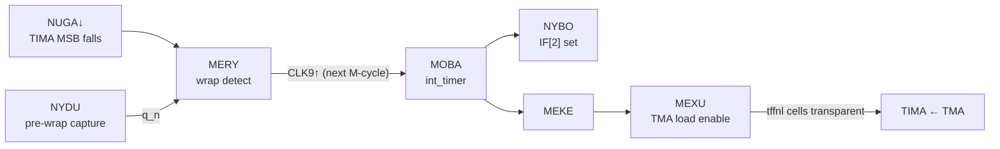

# The Timer

```admonish abstract "In this part"
Four chapters cover the SM83-side subsystems: the timer (this chapter),
[interrupt dispatch](interrupt-dispatch.md), [HALT, EI, and the IME
pipeline](halt-ei.md), and [the IF register](if-register.md).
```

The timer's behavioural surface — DIV, TIMA/TMA/TAC semantics, the reload
quirks, the write-during-reload edge cases — is documented in
[Pan Docs](https://gbdev.io/pandocs/), and this book does not restate it.
(gb-ctr defines the four timer registers in its memory-map tables but does
not yet cover their behaviour.) What this chapter adds is the gate inventory
underneath: the actual counter cells, the exact register-to-counter bit
mapping, and the picosecond-resolution edge sequence of the reload cycle.

```admonish abstract "At a glance"
- DIV and TIMA share **one free-running 16-bit ripple counter** that
  increments per M-cycle; FF04 reads `reg_div16[13:6]`.
- TIMA increments on the **falling edge** of the TAC-selected bit through
  a NOR gate — which is why TAC disables and DIV writes can themselves
  increment it.
- IF[2] and the TMA load both fire **at the start of the reload
  M-cycle** — the "one-M-cycle delay" is wrap-late-in-one-cell to
  IF-early-in-the-next.
- MEXU holds the TIMA cells transparent for the whole reload M-cycle —
  the window where the documented TIMA/TMA write interactions live.
```

| Gate | Role | Type | Clock / Trigger | Notes |
|------|------|------|-----------------|-------|
| UKUP … UPOF | `reg_div16` bits 0–15 | dff | M-cycle boundary, then ~Q ripple | The free-running divider |
| `reset_div_n` | Divider reset net | nor | UCOB (DIV write), reset, TAPE | Resets all 16 DFFs |
| REGA … NUGA | TIMA bits 0–7 | tffnl (toggle FF with load) | LSB by SOGU; ripple by lower bit's q | `mexu`↑ switches all 8 to level-sensitive load |
| UKAP / TEKO / TECY | TAC mux chain | muxi | — | Select the `reg_div16` bit driving TIMA |
| SOGU | TIMA clock gate | nor2 | TECY, `sabo_n` | TAC.2 low ties the TIMA clock high |
| NYDU | NUGA pre-wrap capture | dffr | CLK9↑ | Holds NUGA's previous M-cycle value |
| MERY | Wrap detect | nor2 | NUGA, `nydu_n` | Rises when the MSB just fell |
| MOBA | Wrap capture | dffr | CLK9↑ | Q = `int_timer` |
| MEKE / MEXU | Reload enable chain | not / nand3 | — | MEXU drives the `tffnl` load pins |
| NYBO | IF[2] capture | dffsr | clocked by `int_timer` | [IF register](if-register.md) |

## The 16-bit counter

DIV and TIMA share one free-running 16-bit ripple counter (`reg_div16`):
bit 0 toggles at the M-cycle boundary; each higher bit clocks from the bit
below. It runs unconditionally outside STOP. After a reset deassert it
starts cleanly from 0 — the first M-cycle boundary tick reads 0x0001, with
no reset artefacts on any bit (dmg-sim measurement).

The advance edge, measured by ps-bisect: a 976,000 ps period exactly. Bit 0
toggles ~1.2 ns after the master-clock edge separating consecutive M-cycles,
and each carry stage adds ~1.3 ns of ripple — a boundary carrying through
k bits settles ~(1.2 + 1.3k) ns in.

**DIV is bits [13:6], not the top byte.** The FF04 register reads
`reg_div16[13:6]` combinationally (verified directly in the netlist
model). Because the counter increments per M-cycle rather than per T-cycle,
bit 6 toggles every 64 M-cycles = 256 T-cycles — yielding exactly the
documented 16,384 Hz DIV rate. The bit *numbering* differs from Pan Docs's
T-cycle-scale convention; the observable register matches. A DIV write
clears the whole counter through `reset_div_n`.

## The TIMA path

TIMA is eight toggle cells (REGA → POVY → PERU → RATE → RUBY → RAGE →
PEDA → NUGA), the LSB clocked by SOGU and each higher bit by the lower
bit's q — so bit N+1 toggles on bit N's falling edge. The TAC selection,
in `reg_div16` terms:

| TAC select | Frequency | `reg_div16` bit feeding TIMA |
|-----------:|-----------|------------------------------|
| 00 | 4,096 Hz | bit 7 |
| 01 | 262,144 Hz | bit 1 |
| 10 | 65,536 Hz | bit 3 |
| 11 | 16,384 Hz | bit 5 |

TIMA increments on the **falling edge** of the selected bit, gated by
TAC.2 through SOGU — which is why a TAC disable (or a DIV write that
drops the selected bit) can itself produce an increment: the gate output
falls. (The behavioural consequences are documented in Pan Docs; the gate
explains them all.)

## The reload cycle, edge by edge



NUGA's falling edge is the only TIMA transition that distinguishes the
0xFF → 0x00 wrap. The wrap-detect and reload sequence spans exactly two
M-cycles — the **wrap M-cycle** (TIMA ripples to 0x00 late in it) and the
**reload M-cycle** (IF[2] and the TMA load fire at its start). Measured
(dmg-sim measurement; offsets from each M-cycle's opening CLK9↑):

| Event | Δ | Notes |
|---|---:|---|
| **Wrap M-cycle** | | TIMA = 0xFF entering |
| SOGU↓ (increment edge) | +2,998 ps | selected bit falls |
| TIMA ripples 0xFF → 0x00 | +4,600 → +15,500 ps | ~1,550 ps per stage, NUGA last |
| MERY↑ (wrap detect) | +15,700 ps | 173 ps after NUGA |
| **Reload M-cycle** | | opens at the next CLK9↑ |
| MOBA.q↑ (= `int_timer`) | +0 ps | DFF capture on the boundary edge |
| NYBO.q↑ (**IF[2] set**) | +931 ps | |
| MEKE↓ | +951 ps | |
| MERY↓ | +1,032 ps | NYDU has caught up |
| MEXU↑ (**TMA load begins**) | +2,005 ps | all 8 `tffnl` cells go transparent |
| TIMA visibly = TMA | ≈ +2,000 ps | level-sensitive load |
| MEXU↓ | +978,463 ps | 2,463 ps into the *following* M-cycle |

The key phase fact: **both the interrupt flag and the TMA load fire at the
*start* of the reload M-cycle** — the CLK9 edge that closes the wrap
M-cycle — not at its end. The documented "one-M-cycle delay" between
overflow and interrupt is the gap from the wrap late in one M-cycle
(~+15.7 ns in) to the IF rise early in the next (+931 ps in). MEXU stays
high through the whole reload M-cycle — the window where the documented
TIMA/TMA write interactions play out — and releases 2,463 ps into the next.

The dispatch-side continuation of `int_timer` — through the IF latch and
into the CPU's interrupt chain — is in
[the IF register](if-register.md) and
[interrupt dispatch](interrupt-dispatch.md).
