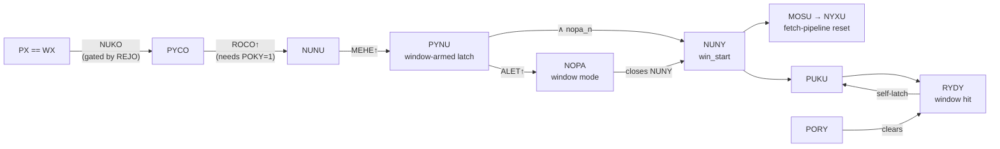

# Window Control

The window subsystem decides when the BG fetcher switches from background to
window tiles within a scanline, and triggers a full fetch-pipeline reset at
the handoff. It comprises a WY-match decoder with a frame-held latch (REJO),
a per-dot WX-match decoder (NUKO), a four-stage trigger chain
(PYCO → NUNU → PYNU → NUNY, three capture stages feeding the
combinational NUNY) gated by LCDC.5, a hit-and-latch condition
(RYDY), a window-mode DFF (NOPA), and the window-trigger pulse (MOSU) that
drives NYXU alongside AVAP and TEVO.

```admonish abstract "At a glance"
- The window arms in two stages: **REJO** (WY matched this frame — set
  once, cleared only by VBlank) gates **NUKO** (PX == WX, per dot).
- The window-trigger dot **MOSU↑** scales with WX and SCX&7 (model
  below); the **window penalty is +6.000 dots** — one BG-fetch restart.
- WX = 167 never fires; WX ∈ [~162, 166] fires but is **observationally
  inert** (XYMU closes the pipe first).
- NUKO's second consumer (PANY) produces the **one-dot BG slip** — even in
  the armed-but-disabled state (REJO=1, LCDC.5=0), where no window
  renders.
```

| Gate | Role | Type | Clock / Trigger | Notes |
|------|------|------|-----------------|-------|
| PALO | WY bits 4–7 + LCDC.5 decode | nand5 | `ff40_d5`, NOJO, PAGA, PEZO, NUPA | The XNOR inputs compare WY bits 4–7 to LY bits 4–7. **LCDC.5 is part of the WY-match decode itself** |
| NELE / PAFU / ROGE | WY decode completion | not / nand5 / not | + NAZE, PEBO, POMO, NEVU (WY bits 0–3) | `wy_match` = LCDC.5 ∧ (LY == WY) |
| SARY | WY-match sampler | dffr | clk = `hclk` (TALU) | Latches `wy_match`; reset by `ppu_reset_n` |
| REPU | REJO reset | or2 | mode1, `ppu_reset2` | Holds REJO cleared throughout every VBlank |
| REJO | WY-match frame latch | nor_latch | s = SARY; r = REPU | `wy_latch` gates the WX decode — no PX==WX cascade can start without it |
| PUKY / NUFA / NOGY / NUKO | WX-match decode | nand5 / not / nand5 / not | PX bits vs WX bits + `wy_latch` | NUKO = `wy_latch` ∧ (PX == WX) |
| PYCO | WX-match capture 1 | dffr | clk = ROCO (pixel-clock-derived; requires POKY=1) | The POKY gate blocks WX=0 from firing before the first BG fetch completes |
| NUNU | WX-match capture 2 | dffr | clk = MEHE (= NOT(ALET)) | Feeds PYNU.s |
| XOFO | PYNU reset (WIN_EN gate) | nand3 | `ff40_d5`, NOT(ATEJ), `ppu_reset_n` | Releases PYNU only when LCDC.5=1 outside the line-end pulse |
| PYNU | Window-armed latch | nor_latch | s = NUNU; r = XOFO | |
| NUNY | Window-trigger pulse | and2 | PYNU, `nopa_n` | Wire name `win_start`; high while armed but not yet captured |
| PUKU / RYDY | Window hit-and-latch | nor2 / nor3 | NUNY+RYDY feedback / PUKU, PORY, `ppu_reset2` | RYDY self-latches via PUKU until PORY clears it |
| NOPA | Window mode | dffr | clk = ALET; d = PYNU | Once captured, the fetcher targets the window tilemap |
| NYFO / MOSU | Trigger buffer | not / not | `win_start` | MOSU drives NYXU |
| WAZY / VYNO / VUJO | Window line counter | not_x1 / dffr ripple | `wy_clk` = NOT(PYNU) | Counts PYNU falling edges |

## The WY-match frame latch (REJO)

> **`wy_match` (= LCDC.5 ∧ LY==WY) → SARY (TALU-clocked) →
> REJO.s**, with REJO.r = REPU = mode1 ∨ `ppu_reset2`

Three properties carry all the behavioural weight:

1. **LCDC.5 lives inside the decode.** PALO's NAND5 includes `ff40_d5`, so
   `wy_match` is force-low whenever the window is disabled — SARY can only
   capture 1 during scanlines where LCDC.5 is held high.
2. **REPU holds REJO cleared through every VBlank.** The set chain only
   becomes effective at REPU's fall at VBlank exit: REJO sets there if SARY
   is already 1, else it waits for a later in-frame `wy_match` capture.
   Under a fixed WY, a missed set at VBlank exit locks REJO at 0 for the
   whole frame (LY cannot re-cross WY except via the 153→0 wrap, which lands
   back inside VBlank).
3. **Once set, REJO cannot be disarmed mid-frame.** A WY rewrite that drops
   `wy_match` cannot clear the NOR latch; only the next VBlank's REPU does.

The capture clock `hclk` is TALU — one rising edge every 4.000 dots at a
fixed phase relative to AVAP (measured anchors at ≈ +0.99, +4.99, +8.99,
+12.99, +16.99 … dots; SCX-invariant, since SCX gates SACU, not the TALU
distribution). A fresh `wy_match`↑ therefore reaches REJO within
0.083 dots of combinational delay plus a race to the next TALU edge —
uniform in [0, 4.000] dots.

**The VBlank WY-rewrite trap** (gambatte `window_late_wy` family, dmg-sim
measurement): a test inherits WY=0, enables LCDC.5 mid-VBlank, and rewrites
WY=$FF before VBlank exits. The LY 153→0 wrap briefly raises `wy_match` and
SARY captures 1 — but REPU still holds REJO at 0. The WY=$FF write drops
`wy_match`; SARY recaptures 0 on its next TALU edge, ~1.4 ns *before* mode1
falls. At VBlank exit SARY=0, REJO stays 0, and the window never fires all
frame. The whole family's hardware-pass outcomes follow from this SARY/REPU
edge order.

**Mid-Mode-3 fresh arming** (gambatte `late_wy_FFto2` sub-cluster at SCX ∈
{0, 2, 3}, dmg-sim measurement): the WY=$02 write lands at LY=2
AVAP+15.495 dots; `wy_match` rises +0.080 dots later; the next TALU edge at
+16.992 captures it and REJO sets at +16.997 — identically across all three
SCX variants. Whether the *same-scanline* cascade fires then depends on
whether the one-dot PX==WX window is still open when REJO arms:

| SCX | PX==7 window (dots from AVAP) | REJO↑ at | Same-line outcome |
|-----|-------------------------------|----------|-------------------|
| 0 | [13.03, 14.03] | +16.997 | window closed 2.97 dots earlier — no fire |
| 2 | [15.03, 16.03] | +16.997 | closed 0.97 dots earlier — no fire |
| 3 | [16.03, 17.03] | +16.997 | REJO arms *inside* the window — a ~8 ns combinational NUKO glitch that spans no PYCO capture edge |

In all three, LY=2 renders without a window and LY=3 fires the standard
cascade (REJO holds across H-Blank). PX is monotonic within a scanline: once
past WX, no same-line re-fire is possible without a WX rewrite. The general
rule: the cascade fires same-line only if REJO's set (write dot + 0.083 +
TALU race) lands before the PX==WX window closes — and increasing SCX
widens that budget dot-for-dot, since the window shifts with the fine-scroll
delay while TALU's phase does not.

## The 10-step activation sequence



With WIN_EN=1, REJO=1, and the fetcher idle (POKY=1):

1. PX reaches WX → NOGY drops → NUKO rises.
2. PYCO captures NUKO on the next ROCO edge.
3. NUNU captures PYCO on the next MEHE edge.
4. PYNU sets (window armed).
5. NUNY = AND2(PYNU, `nopa_n`) rises → `win_start` → MOSU rises.
6. PUKU drops; RYDY = NOR3(0,0,0) rises (window hit).
7. NOPA captures PYNU on the next ALET edge (window mode active).
8. NUNY falls → MOSU falls.
9. PUKU stays low — RYDY's own feedback holds it.
10. RYDY remains latched until PORY rises during the restarted BG fetch's
    cascade — the SUZU falling edge that tells the fetcher to load window
    tile data.

**RYDY's fan-out** (each via the shared SYLO/TOMU triple-inversion): SOCY
halts CLKPIPE ([BG pipeline](bg-pipeline/pixel-clock.md)), TUKU blocks the sprite
trigger ([sprite pipeline](sprite-pipeline/fetch-machine.md)), and SUZU (via TUXY) drives
TEVO's window-restart arm.

**MOSU drives the same 7-dot pipeline reset as AVAP.** Measured on a
window-firing scanline (dmg-sim measurement):

| Event | Value |
|---|---|
| MOSU↑ | +6.989 dots from AVAP |
| NYXU↓ | 441 ps after MOSU↑ |
| MOSU pulse width | 0.494 dots |
| NYXU pulse width | 0.503 dots |
| Cascade restart (NYKA↑) | +5.492 dots after MOSU |
| First window pixel | +7.037 dots after MOSU |

MOSU, AVAP, and TEVO each drive NYXU independently through the NOR3 — they
do not combine or extend each other.

One interaction: at WX=0 with `SCX & 7` = S > 0, the first window pixel
lands +S later still (+10.037 at SCX=3). MOSU fires at the POKY floor
*before* the line's fine scroll has been paid, and the post-restart pixel
start absorbs it; at WX ≥ 1 the pipe is already running and +7.037 holds
at any SCX.

## The per-WX timing model

Measured across the full gbmicrotest window sweep (dmg-sim measurement,
`win[0-15]_a` ROMs; all values sim-dots):

- **MOSU↑ from AVAP = 6.989 + WX** for WX ≥ 1 — one dot per WX step.
- **WX=0 fires at the same +6.989 floor**: the POKY gate on PYCO's clock
  blocks anything earlier (PX==0 is true from reset, but no capture clock
  runs until the first fetch completes).
- **Window penalty: +6.000 dots, invariant across WX ∈ [0, 15]** — exactly
  one BG-fetch restart.

The joint (WX, SCX) generalisation: SCX enters only through the PX==WX
match dot (PX advances on SACU, which starts `(SCX & 7)` dots later); the
capture chain downstream of NUKO has no SCX dependence, and the WX=0 POKY
floor is SCX-invariant:

```admonish tip "Rule: the joint (WX, SCX) trigger model"
~~~
MOSU↑(WX, SCX) = 6.989                     if WX = 0   // POKY floor, SCX-invariant
               = 6.989 + WX + (SCX & 7)    if WX ≥ 1   // PX-driven
~~~
```

Measured joint anchors: (WX=0, SCX=3) → +6.989 (floor confirmed SCX-invariant);
(WX=10, SCX=0) → +16.989; (WX=10, SCX=3) → +19.989 — the formula is exact at
all three (dmg-sim measurement, gbmicrotest `win{0,10}_scx3_a` ROMs, 1,290 firing
scanlines each, zero variance).

**Sprite-coincident MOSU delay.** A sprite fetch overlapping the capture
window freezes ROCO (PYCO's capture clock) with the rest of CLKPIPE; NUKO
stays high (PX is frozen too), and the capture fires on the first ROCO edge
after TAKA clears — the whole cascade shifts 6.000 dots later. Measured at the
collision band of Mealybug `m3_lcdc_win_map_change` (WX=7, sprite X=7 at
LY=56–63): MOSU↑ at +19.989 vs the +13.989 control — the 5.515-dot TAKA
window plus post-freeze ROCO alignment (dmg-sim measurement, zero variance
across 56 collision scanlines).

Whether the sprite cost appears as "MOSU later" or "Mode 3 longer at the
tail" depends only on whether TAKA overlaps the capture window; total
Mode 3 picks up the same +6 dots either way.

## Edge cases

Three self-contained edge-case studies — the right-edge inert zone,
multiple window activations on one scanline, and the NUKO/PANY one-dot
slip — are collected in [Window edge cases](window/edge-cases.md).
